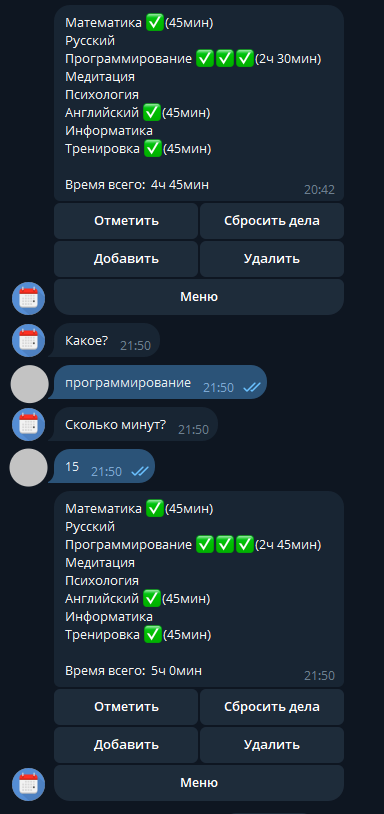

# ⏱ QFD: yourQuestsForDay

> Telegram-бот для планирования дня, хронометража задач и отслеживания личной продуктивности. Проект разработан в 9 классе (2023 г.).

---

## 🎯 О проекте

Бот помогает структурировать день, фокусироваться на задачах и объективно оценивать, сколько времени уходит на их выполнение. 

Проект создавался как личный инструмент для фокуса на учебе и делах, а также для изучения работы с реляционными базами данных (SQL) и асинхронной/событийной логикой Telegram-ботов.

---
| запись времени, сколько позанимался | страница профиля |
|:---:|:---:|
|  |  |
---

## ✨ Ключевой функционал

- 📝 **Планирование дня:** Быстрое создание списка дел на текущий день.
- ⏳ **Учет времени (Time Tracking):** Фиксация потраченных минут на каждое конкретное задание.
- 📊 **Геймификация и визуализация:** 
  - Начисление статусов (`✅`, `✅✅`, `✅✅✅`) в зависимости от уделенного времени (до 1ч / от 1ч / от 2ч).
  - Автоматический подсчет суммарного времени за день.
- 🔄 **Повтор рутин:** Возможность скопировать вчерашний список дел в один клик.
- 👤 **Профиль пользователя:** Общая статистика за всё время (всего отработано часов/минут, дней в боте).
- 💡 **Интерактивные уведомления:** Случайные мотивирующие сообщения и подбадривания при заполнении задач.

---

## 🛠 Технологический стек

- **Язык:** Python 3
- **Библиотека бота:** `pyTelegramBotAPI` (`telebot`)
- **База данных:** SQLite3 (чистые SQL-запросы, агрегации `SUM`, работа с датами `CURRENT_DATE`)
- **Интерфейс:** Inline-кнопки, Telegram WebApp (интеграция с DonationAlerts), Multi-step handlers.

---

## 🗄 Структура базы данных (SQLite)

- **`users`** — хранение пользователей, даты регистрации и общего накопленного времени (`sum_time`).
- **`works`** — хранение текущих задач, привязка к `id_user_tg`, даты выполнения и времени в минутах (`time_m`).

---

> *Примечание: Это один из моих первых проектов, написанный во время обучения в школе. Код сохранен в исходном виде как память о начале пути в разработке.*
